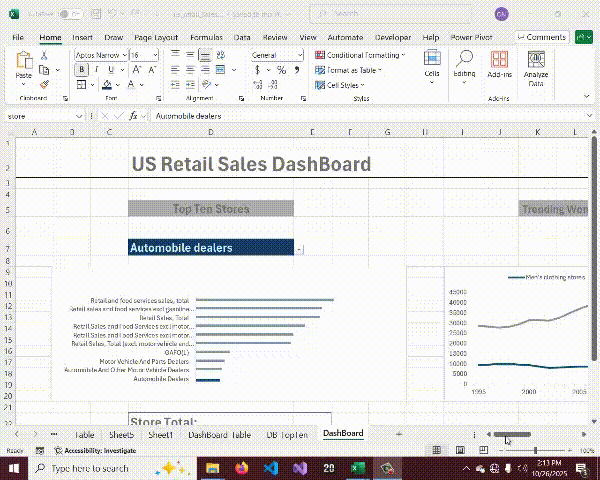
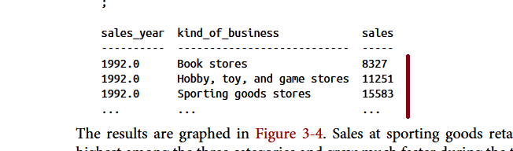

## US Monthly Retail Sales Data Analysis

## Introduction:
 While going through this wonderful Excel course (Excel for Data Analytics - Full Course) by Luck Barousse; i was at the same time reading this  wonderful  data analysis book (SQL for Data Analysis
 (O’Reilly)  Copyright 2021 ) by Cathy Tanimura.  

 Apparently while Luck Barousse used excel for his analysis; Cathy Tanimura on the other hand used SQL(Structure  Query Language).

 And out of curiosity I decide to used the knowlede gained from the Excel course on the dataset of the book to see if i will get the same results table-wise, chart-wise and query-wise  when compared to that of the SQL book.
 This project focuses mainly on the Trending section of Chapter 3 of the Book.

##### Link to Excel course: https://lukebarousse.com/excel

##### Link to SQL book:  https://oreil.ly/sql-data-analysis

**Questions To Analyze:**  
 As mentioned earlier; this project will focus mainly on the Trending section of chapter 3 and below are some of the question we shall be answering:

- what is the trend  of yearly retail sales for sporting goods, hobby, toy and game store and book store (as in page 78)

- what is the yearly trend of sales at women's and men's store clothing store (book page 81)

- what is the yearly difference between sales at women's and men's clothing store (book page 83)

- what is the top ten sector/store with the most sales.

 

### Dashboard Files:
The final Dashboard for this project can be found here: [dashboard.xlsx](Resources/dashboard.xlsx)

### Excel Skills/Formula Used:
The following Excel skills were utilzed in this project
- Excel formula
- Pivot Table
- Pivot Chart
- Data Validation
- XLookup
etc

### Dataset Used:
The data set for the this project is the 
**monthly US retail sales from
the Monthly Retail Trade Report: Retail and Food Services Sales: Excel (1992–
2020)** 

It includes information for the NAIC codes, Kind of Business, and Monthly sales data and is available in the link below.
-  [Dataset](https://www.census.gov/retail/index.html#mrts)

 The original file format
is an Excel file, with a tab for each year and with months as columns. The [GitHub site](https://oreil.ly/LMiHw)
for the book has the data in a format that’s easier to use.

So, with the dataset out of the way lets delve into the analysis.
### What is the trend  of yearly retail sales for sporting goods, hobby, toy and game store and book store (as in page 78)
Using Excel Pivot Table and Chart, it was  observed that the sum of the sales data based on the year and kind of business which in this case are: Book store; Hobby,toy,game store; and sporting goods store returned same data and similar chart as seen below:

- Table snapshot from book:

  

- Table snapshot from Excel:
  
  
And below are the charts:

- From Book
  
  
- From Excel

  

### What is the yearly trend of sales at women's and men's  clothing store? (book page 81)
Still using Excel Pivot Table and Chart, the below result was obtained, both for the table and chart.
Here is result for the table:
  - Book

       

  - Excel
        

  Here is result for the chart:
  - Book

    

  - Excel
    

### What is the yearly difference between sales at women's and men's clothing store? (book page 83)

Still taking the same pattern, we have :
- Book Table

  

- Excel Table
  

And below are the charts for both Book and Excel respectively:
 

### What is the top ten sector/store with the most sales?
 I equally went  further to  analize the ten topmost sector/stores with the highest sales.

### Conclusion:
My findings from this project reveals that both, tables, charts and query obtained using Excel application and that as seen in the book which uses SQL(and Postgress Database) are similar, if not the same and I hope this project will encourage more data analyst to adding Microsoft Excel to their toolkit.

